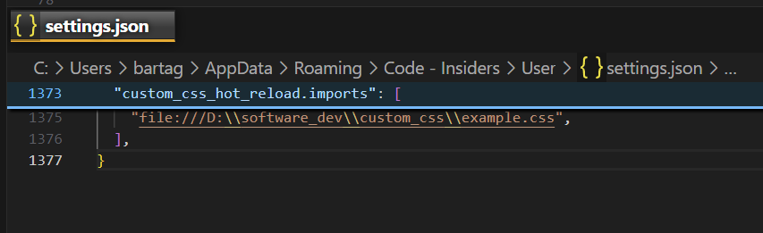

# Custom CSS Hot Reload

This extension makes it easier to style VSCode by instantly applying the added CSS. Just simply open the CSS file you set in the config and start editing.
 
## Getting Started


1. Install this extension.

2. Add to `settings.json`:

In the `custom_css_hot_reload.imports` array, you can define custom CSS and JS files to be injected into the editor. Each item in the array should be a URL pointing to a CSS or JS file.

```json
"custom_css_hot_reload.imports": [
	"file:///absolute/path/to/custom.css",
]
```

Contents of `custom.css` file:
```css
.monaco-list .monaco-list-row.selected {
  background-color: rgba(55, 173, 203, 0.75) !important;
  border-radius: 6px;
}
```
For more examples see `CSS Examples` section below.

4. The first time after install, activate the command "`Custom CSS Hot Reload: Enable`".


## Extension commands

Access the command palette and introduce commands you can use ***Ctrl+Shift+P*** 

- ***Custom CSS Hot Reload: Enable***: It will enable the extension.
- ***Custom CSS Hot Reload: Disable***: It will disable the extension.
- ***Custom CSS Hot Reload: Reload***: Disable and then re-enable it.

## Uninstall

1. Run `Custom CSS Hot Reload: Disable`
2. After uninstalling the extension, you need to restart VS Code.

### Example CSS

<details>
  <summary>Explorer Sticky Row </summary>

```css
.explorer-viewlet .monaco-tree-sticky-container {  
  border-bottom: 2px #344349 solid !important;
  padding-bottom: 2px;
  background-color: #237589 !important;
}

.monaco-scrollable-element .monaco-tree-sticky-container .monaco-tree-sticky-row {
  background-color: #082c35 !important;
}
```
</details>


<details>
<summary>Editor Tabs</summary>

```css
.dirty .monaco-icon-label:after {
	transform: scale(2);
	right: 2px;
}

.monaco-icon-label:after {
	position: absolute;
	content: "";
	background-color: rgb(255 255 0 / 90%);
	top: 2px;
	border-bottom-left-radius: 100px;
	width: 4px;
	height: 4px;
	transform: scale(0);
	transition: all 0.3s;
}

.monaco-workbench .part.editor>.content .editor-group-container>.title .tabs-container>.tab {
	height: 24px !important;
	text-shadow: 0 0 5px #000000;
}

.monaco-workbench .part.editor>.content .editor-group-container>.title>.tabs-and-actions-container.wrapping .tabs-container>.tab {
	border-bottom: unset;
	max-width: 170px;
}

.monaco-workbench .part.editor>.content .editor-group-container.empty .editor-group-letterpress {
	background-image: unset;
}

.monaco-workbench .part.editor>.content .editor-group-container.empty>.editor-group-letterpress {
	max-width: 300px;
	min-width: 250px;
	max-height: 300px;
	min-height: 250px;
	background-size: unset;
}

.monaco-workbench .part.editor>.content .editor-group-container>.title .editor-actions {
	height: 23px !important;
}

.monaco-workbench .part.editor>.content .editor-group-container>.title .editor-actions .action-label,
.monaco-workbench .part.editor>.content .editor-group-container>.title .title-actions .action-label {
	height: 23px !important;
}

.monaco-workbench .part.editor>.content .editor-group-container>.title .monaco-icon-label:before {
	height: 23px;
}

.monaco-workbench .part.editor>.content .editor-group-container>.title .tabs-container>.tab {
	padding-left: 0px;
}

.monaco-workbench .part.editor>.content .editor-group-container>.title .tabs-container>.tab .tab-label {
	line-height: 23px;
}

.monaco-workbench .part>.title>.title-label h2 {
	font-weight: bold;
}

.show-file-icons .javascript-lang-file-icon.file-icon::before {
	background-size: 90% !important;
	transform: scale(1.2);
}

.tab {
	margin: 3px;
	background-color: rgba(255, 255, 255, 0.15) !important;
	transition: 0.2s;
	background-image: -webkit-linear-gradient(top, #8c8c8ca6 0%, rgba(0, 0, 0, 0) 60%);
	box-shadow: 0 0 9px rgba(0, 0, 0, 0.6);
}

.tab .label-name {
	padding-right: 5px;
}

.tab .monaco-icon-label-container {
	padding-left: 4px;
	max-width: 160px;
	overflow: hidden !important;
	text-overflow: ellipsis;
	padding-right: 4px;
}

.tab-actions {
	display: none;
}

.monaco-workbench .part.editor>.content .editor-group-container>.title.breadcrumbs .monaco-icon-label:after,
.monaco-workbench .part.editor>.content .editor-group-container>.title.tabs .monaco-icon-label:after {
	content: ' ' !important;
}

.tab:hover {
	background-color: rgba(255, 255, 255, 0.3) !important;
}

.tab.active {
	border-bottom-width: 3px !important;
	border-bottom-color: orange !important;
	border-bottom-width: 2px !important;
	border-bottom-style: solid !important;
}

.tab.active:hover {
	background-color: rgba(215, 215, 215, 0.573) !important;
}

.tabs .javascript-lang-file-icon {
	margin-right: -10px;
	box-shadow: inset 0 0 50px 0 rgb(25 234 132 / 38%);
}

.tabs .markdown-lang-file-icon {
	box-shadow: inset 0 0 50px 0 rgb(213 0 0 / 38%) !important;
}

.tabs-container .actions-container {
	display: none !important;
}

.tabs-container .monaco-icon-name-container {
	color: white;
	font-weight: 700 !important;
}

.tab.active .monaco-icon-name-container .label-name {
	color: white !important;
	font-weight: 700 !important;
}

.title.tabs.show-file-icons .file-icon::before {
	background-size: 100% !important;
	background-color: rgba(0, 0, 0, 0.3);
}
```
</details>


<details>
<summary>Editor Sticky Row</summary>

```css
.monaco-editor .sticky-widget {
  order-bottom: 2px #15beff solid !important;
	padding-bottom: 2px;
	background-color: #082c35 !important;
}

.sticky-line-number-inner {
	color: #15beff;
}
```
</details>
<!--  -->


## Windows users 

**In Windows, make sure you run your Visual Studio Code in Administrator mode before enabling or disabling your custom style!**

## Mac and Linux users
**The extension will NOT work if Visual Studio Code cannot modify itself.** The cases include:

- Code files being read-only, like on a read-only file system or,
- Code is not started with the permissions to modify itself.

**You need to claim ownership of Visual Studio Code's installation directory by running this command**:

```sh
sudo chown -R $(whoami) "$(which code)"
sudo chown -R $(whoami) /usr/share/code
```

The placeholder `<Path to Visual Studio Code>` means the path to the VSCode installation. It is typically:

- `/Applications/Visual Studio Code.app/Contents/MacOS/Electron`, on MacOS;
- `/Applications/Visual Studio Code - Insiders.app/Contents/MacOS/Electron`, on MacOS when using the Insiders branch;
- `/usr/share/code`, on most Linux;
- `/usr/lib/code/` or `/opt/visual-studio-code` on Arch Linux.

Mac and Linux package managers may have customized the installation path. Please double-check your path is correct.

# Disclaimer

This extension modifies some Visual Studio Code files, so use it at your own risk.
This extension solves this issue by injecting code into:

- `electron-browser/index.html`.

The extension will keep a copy of the original file in case something goes wrong. That's what the disable command will do for you.

As this extension modifies Visual Studio Code files, it will get disabled with every Visual Studio Code update. You will have to enable the extension via the command palette.

Take into account that this extension is still in beta, so you may find some bugs while using it. Please, report them to [the issues section of the Github's repo](https://github.com/BartaG512/custom-css-hot-reload/).
